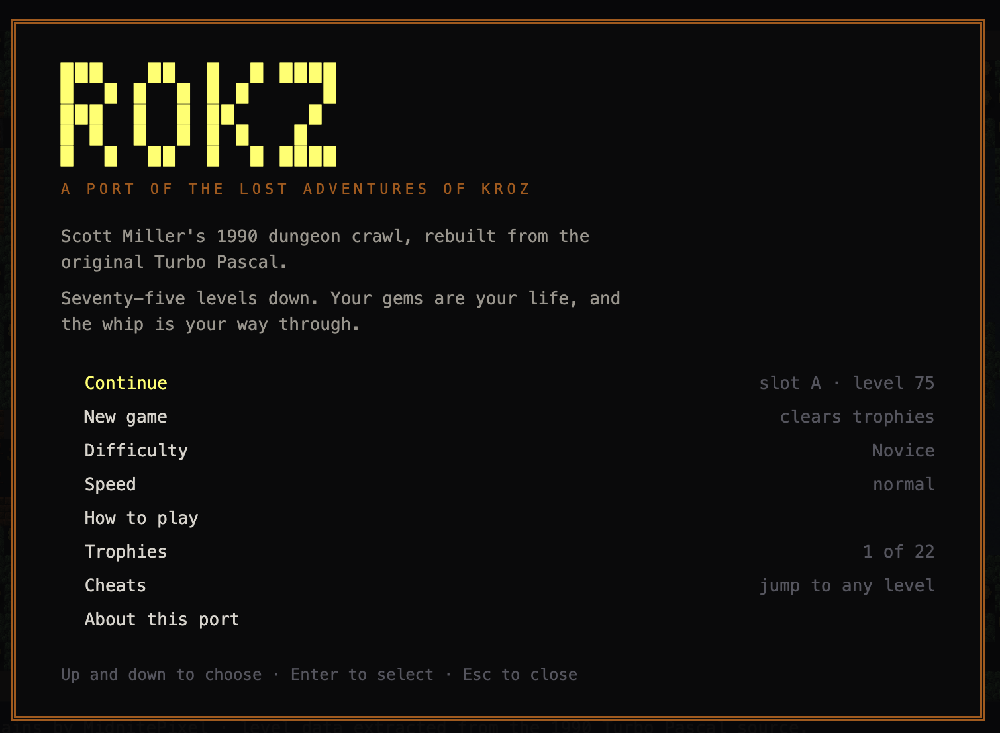
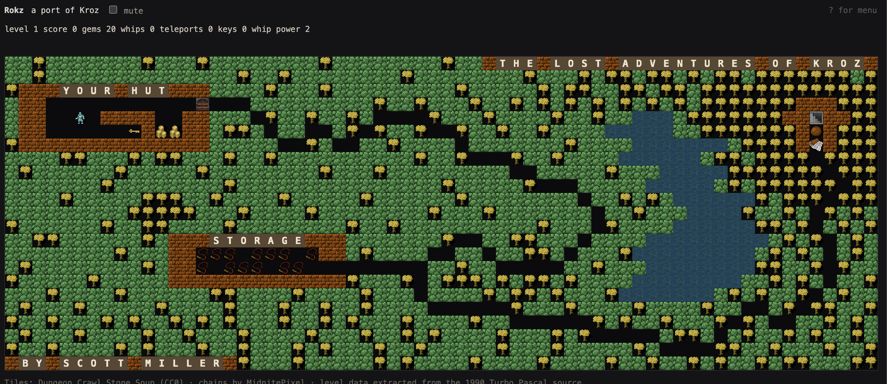

# Rokz

A browser port of **The Lost Adventures of Kroz** (Scott Miller, Apogee Software, 1990),
built directly from the original Turbo Pascal source.





All 75 levels, the monsters, the spells, the traps and the sounds are read out of the
1990 code rather than recreated by hand. The 943 hand-drawn layout rows in this repo
still match the Pascal byte for byte, high-bit CP437 characters included.

```bash
npm install
npm run dev      # http://localhost:5180
```

---

## What it is

Kroz was Apogee's first game — the one the company was built on. It is a real-time
dungeon crawl on a 64×23 grid where **gems are your health**, the whip is your only
weapon, and the way past most obstacles is to lure something into them. Apogee released
the games as freeware in 2009 and the source under the GPL alongside.

This port keeps the rules exactly and replaces only the presentation: text-mode
characters become sprites, and the PC speaker becomes a Web Audio oscillator.

## How it was built

The interesting part is that almost nothing here was authored. A pipeline reads the
Pascal and emits the data the game runs on:

```
npm run data     # extract → verify → pack → typecheck
```

| Step | What it does |
|---|---|
| `extract` | Parses `LOST1.LEV`, `LOST2.LEV`, `LOST2B.LEV` and `LOST.PAS` into JSON: tile table, render table, level layouts, scatter tables, per-level parameters |
| `verify` | Re-emits every layout row and diffs it against the Pascal, then asserts pinned counts so a parser regression fails loudly |
| `pack` | Composites the referenced sprites into one atlas |
| `smoke` | 52 assertions over the engine rules |

Kroz stores a level in one of two forms, and both are handled. **41 levels are
hand-drawn** ASCII art. The other **34 are scatter tables** — a fixed-width row of
counts saying "place 80 slow monsters, 50 blocks, one staircase" — which the game
sprinkles at random. Miss the second form and you lose 45% of the game.

Several oddities in the original survive intact, because they are the original:

- `AddScore` is a lookup table where bumping walls **costs** you points
- Monsters iterate in spawn order, from a work list that is never synced with the grid
  and heals itself lazily instead
- Level 44's seventh row is one character short — a 1990 typo that renders as a
  one-cell gap in the diary's border
- `DF[71]`'s scatter table is a character too wide, which Turbo Pascal's `string[222]`
  truncation never fixed

## Layout

```
src/engine/     the port proper: playfield, movement, monsters, world systems
src/render/     canvas renderer, CP437 mapping
src/audio/      PC speaker emulation
src/data/       generated — level and tile data, atlas coordinates
tools/          the extraction and packing pipeline
assets/         sprites generated for tiles the tileset has no equivalent for
```

## Regenerating the data

`src/data/*.json` and `public/atlas.png` are committed, so the game builds and runs
without anything else. Regenerating them needs two third-party sources, neither
redistributed here:

1. **The Kroz freeware release** (Apogee, 2009) — the tools read
   `../../source/LOSTKROZ/MASTER/`
2. **Dungeon Crawl Stone Soup tiles**, Oct 2010 — read from
   `../../assets/crawl-tiles Oct-5-2010/`

With both present, `npm run data` rebuilds everything and verifies it against the source.

## Controls

Arrows, WASD or the numpad to move; `QEZC` for diagonals. `Space` whips, `T` teleports,
`P` pauses, `K`/`L` save and load, `Shift-R` restarts. `?` opens the menu. Click any
tile to identify it.

## Where it diverges

Deliberately, and noted in the code:

- **Level generation** uses a shuffled cell list instead of the original's unbounded
  rejection sampling, which could take thousands of attempts on levels that fill 99%
  of the playfield
- **Pacing** is a wall-clock tick. The original spun a counting loop and asked the
  player "Slow or Fast PC?" at startup, so no true rate is recoverable from the source
- **Quality-of-life** additions: a tile inspector, a K-R-O-Z tracker, and trophies —
  all read-only observers that cannot affect play

## Credits

- **Kroz** by Scott Miller, © Apogee Software. Source released under GPL v2 in 2009.
- **Tiles** from Dungeon Crawl Stone Soup and rltiles, released under CC0.
- **Chains and ceiling rail** derived from **New Gothic Haunted Castle Tileset 32x32**
  by **MidnitePixel**, used with the author's permission.

"Kroz" is a trademark of Apogee Software. This is an unaffiliated port.

## Licence

GPL v2 or later, inherited from the original source. See `LICENSE`.
